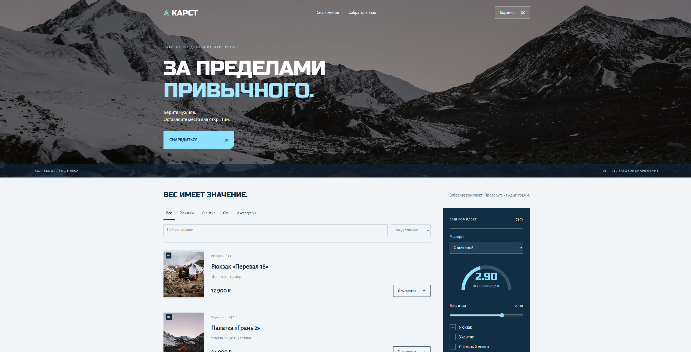
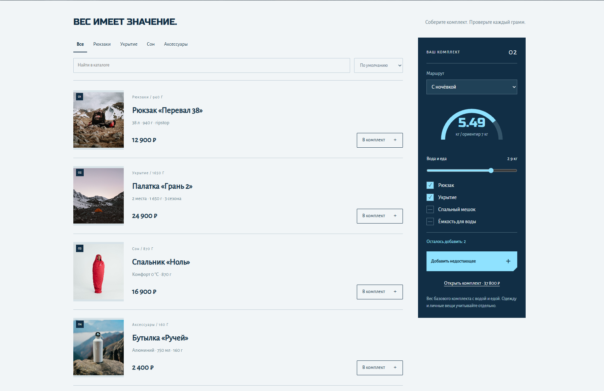
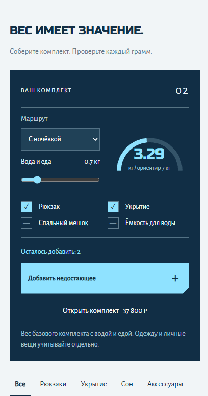

# КАРСТ

Интернет-магазин туристического снаряжения с каталогом, корзиной и интерактивным конструктором рюкзака.

Проект сделан как самостоятельный портфолио-кейс с клиентской частью, серверным API, локальной базой данных и отдельной логикой подбора базового комплекта для маршрута.

## О проекте

«КАРСТ» — концепт магазина лёгкого туристического снаряжения.

Основная идея проекта — не просто показать товары, а помочь пользователю собрать базовый комплект и сразу понять, сколько он будет весить.

Для этого в интерфейсе есть отдельный блок «Собрать рюкзак»: пользователь выбирает тип маршрута, указывает примерный вес воды и еды, а приложение считает общий вес комплекта и показывает, каких базовых вещей ещё не хватает.

## Превью

### Десктоп





### Мобильная версия



## Возможности

- каталог туристического снаряжения;
- фильтрация по категориям;
- поиск по каталогу;
- сортировка по цене;
- подробные карточки товаров;
- корзина с изменением количества;
- сохранение корзины в `localStorage`;
- учёт доступных остатков;
- оформление тестового заказа;
- серверная проверка стоимости и остатков;
- адаптивный интерфейс;
- резервный статический режим работы при недоступном API.

## Конструктор рюкзака

Одна из основных функций проекта — интерактивная сборка комплекта для маршрута.

Пользователь может выбрать:

- маршрут на один день;
- маршрут с ночёвкой;
- дополнительный вес воды и еды.

Приложение учитывает вес добавленного снаряжения и сравнивает его с ориентиром:

```text
Однодневный маршрут: 3,5 кг
Маршрут с ночёвкой: 7 кг
```

Для однодневного маршрута проверяются:

```text
Рюкзак
Ёмкость для воды
```

Для маршрута с ночёвкой:

```text
Рюкзак
Укрытие
Спальный мешок
Ёмкость для воды
```

Если чего-то не хватает, недостающие позиции можно добавить в комплект одной кнопкой.

Также интерфейс показывает, когда общий вес превышает выбранный ориентир.

## Технологии

### Frontend

- React 19
- TypeScript
- CSS

### Backend

- Node.js
- Node HTTP Server
- SQLite

### Сборка и инструменты

- esbuild
- TypeScript Compiler
- Docker
- Node Test Runner

## API

Проект содержит собственный серверный API.

Основные маршруты:

```text
GET  /api/health
GET  /api/catalog
POST /api/orders
GET  /api/orders/:id
```

При оформлении заказа сервер повторно рассчитывает стоимость, проверяет доступные остатки и сохраняет заказ в SQLite.

## Локальный запуск

Для запуска требуется Node.js 24 или новее.

Клонировать репозиторий:

```bash
git clone https://github.com/wakukiku/karst.git
cd karst
```

Установить зависимости:

```bash
npm install
```

Запустить проект:

```bash
npm run dev
```

По умолчанию приложение запускается по адресу:

```text
http://localhost:3000
```

## Production-сборка

Собрать проект:

```bash
npm run build
```

Запустить собранную версию:

```bash
npm start
```

## Проверка типов

```bash
npm run check
```

## Тесты

```bash
npm test
```

Тестами покрыты:

- расчёт веса комплекта;
- учёт количества одинаковых товаров;
- проверка обязательных категорий снаряжения;
- разные ограничения веса для дневного маршрута и маршрута с ночёвкой;
- серверный расчёт стоимости заказа;
- проверка остатков;
- защита от повторного создания одного заказа;
- изоляция заказов по пользовательским сессиям;
- сохранность данных SQLite.

## Переменные окружения

Пример конфигурации находится в `.env.example`.

```env
PORT=3000
HOST=127.0.0.1
DB_PATH=./data/store.sqlite
```

## Docker

В проекте есть `Dockerfile`.

Пример запуска:

```bash
docker build -t karst .
docker run -p 3000:3000 karst
```

## Изображения

Проект использует фотографии из открытых источников для демонстрационного портфолио-концепта.

Источники и лицензии указаны в [`ASSETS.md`](./ASSETS.md).

## Статус

Проект завершён как портфолио-кейс.

Оформление заказа работает в демонстрационном режиме. Реальная оплата и доставка не выполняются.

---

**КАРСТ** — портфолио-проект магазина туристического снаряжения.
